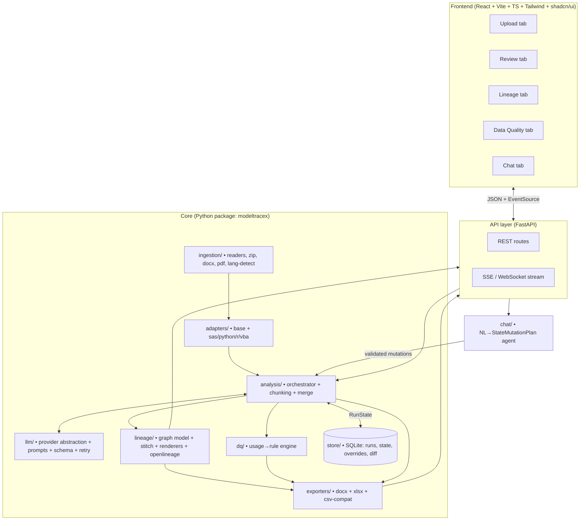
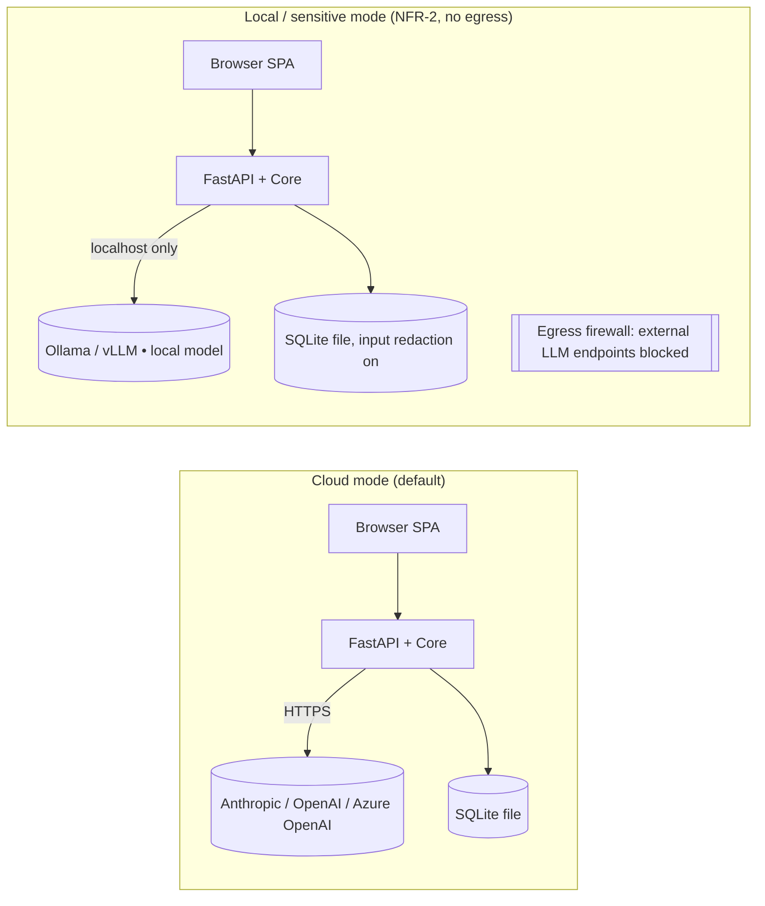
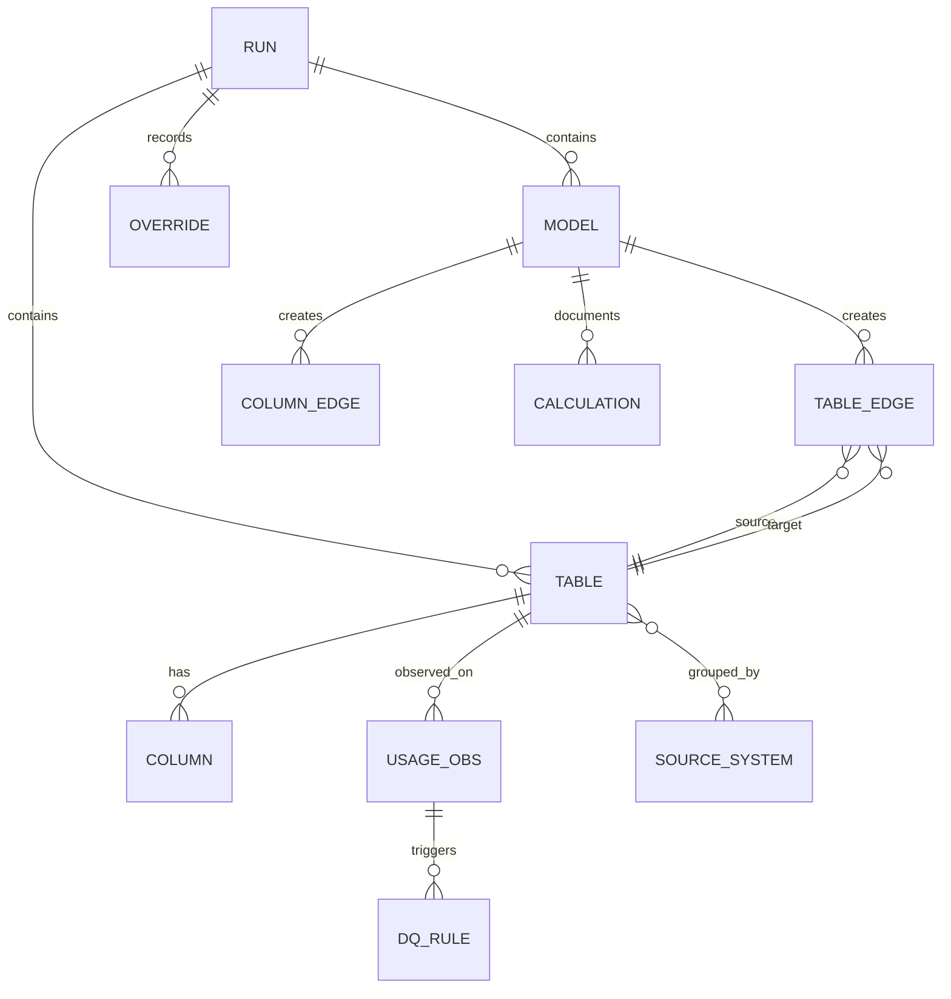
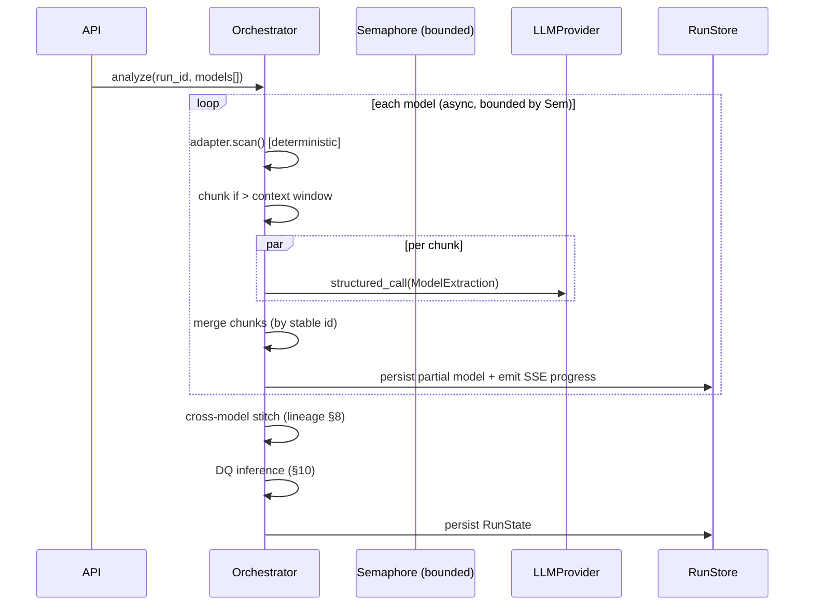
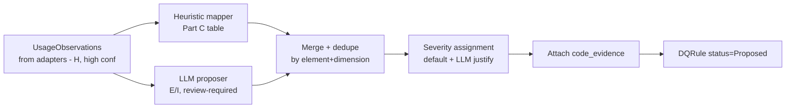

# ModelTraceX v2 — Software Design Document (SDD)

**Status:** For build. Decision-ready. **Revision 1.2** — front end restyled onto the **shared dark design system** (single source of visual truth with MVA), specified against `ModelTraceX_v2_UI_Mockup_dark.html` (see §22 changelog; §21 retained for the rev-1.1 mockup-integration history).
**Author role:** Senior Solution Architect
**Inputs reconciled:** *ModelTraceX v2 — Requirements Document* (FR-/NFR-, §12 deliverables, §13 open decisions) and *ModelTraceX v2 — Document & Lineage Workbook Specification* (Parts A–D).
**Predecessor:** `ModelTraceX.py` (v1, single-module SAS reviewer).

---

## 0. How to read this document

This SDD covers all **16 deliverables** from Requirements §12, resolves all **5 open decisions** from §13, and defines the canonical state as concrete Pydantic v2 models consistent with Spec Part D. Section numbering maps to the §12 deliverable list where practical. Trade-offs and risks are stated inline and consolidated in §17–18.

A reconciliation pass (§2) precedes the design, surfacing conflicts/gaps between the two source documents and stating how each is resolved. A full FR/NFR traceability matrix is in §19.

**Decision shorthand used throughout:** > **Decision / Rationale / Trade-off** call-outs mark every significant choice.

**Rev 1.1 note:** the front-end design (§13.4) is now specified against the UI mockup; mockup-driven decisions are D1–D10 (§17.1), UI↔requirement traceability is §19.1, and the full delta is the §21 changelog.

**Rev 1.2 note:** the front-end *skin* now adopts the **shared MVA dark design system** — tokens, fonts (Manrope + JetBrains Mono), palette, and umbrella ("Modelis") branding. This is a visual change only: the five tabs, layouts, component behaviour, wireframes, data model, API, and all functional decisions (D1–D10) are unchanged. The full design-system delta is the §22 changelog.

---

## 1. Assumptions (the optional preferences block was left blank)

| # | Assumption | Basis |
|---|---|---|
| A1 | Both **cloud and local/on-prem** deployment are required (not one). | NFR-2 mandates a no-egress local mode; cloud is the default for non-sensitive work. |
| A2 | Recommended stack (FastAPI + React/Vite/Tailwind/shadcn) is **adopted**, with justified deviations only. | Requirements §8 recommends it; keeps analysis in Python. |
| A3 | Team of **3–5 engineers**; phases sized in ~2-week increments; no hard external deadline. | Not specified; sizing affects phasing granularity only, not architecture. |
| A4 | **Nothing from v1 must be preserved verbatim** — v1 is a rewrite target. Concepts (SAS regexes, Graphviz swim-lanes, normalizers) are migrated, not frozen. | §1, §14 of requirements describe v1 as the thing being replaced. |
| A5 | Single-tenant deployment; no SSO/RBAC in v2 (future, per §11). | §11 out-of-scope. |
| A6 | Python 3.11+ backend; Node 20+ / TypeScript frontend. | Modern baseline; `tomllib`, exception groups, faster asyncio. |

These are choices I would normally confirm with a product owner but none **block** the design; each is reversible at config level.

---

## 2. Reconciliation: conflicts, gaps, and ambiguities (and resolutions)

I read the two documents together. They are largely aligned. The following discrepancies were found and resolved; none require a product decision.

| # | Type | Finding | Resolution |
|---|---|---|---|
| R1 | **Conflict (enum)** | `transformation_type` in Requirements FR-5.2 has **7** values (filter/join/aggregate/derive/rename/cast/passthrough). Spec Part D + Sheets 5/6 add **`union`** (8). | Adopt the **superset incl. `union`** as canonical (`TransformationType` enum). Spec is the contract for outputs. |
| R2 | **Gap** | NFR-6 requires token/cost **per run *and* per model**, but Part D only has `tokens`/`est_cost` on `run`, not on each model. | **Extend** each model with a `telemetry` sub-object (`tokens_in/out`, `est_cost`). Run-level is the sum. Flagged as an additive extension to Part D. |
| R3 | **Gap (taxonomy granularity)** | DQ inference (Part C) keys off fine-grained usages (*denominator, date-parse, range filter, equality-against-set, time-window…*), but `Column.used_in` (Part D / Sheet 4) is coarse (filter/join/aggregate/calc/output). The coarse tag cannot drive Part C. | Introduce a first-class **`UsageObservation`** record (element + `usage_kind` + `evidence` + provenance) emitted by adapters. DQ inference consumes `UsageObservation`s; `Column.used_in` is a **roll-up projection** of them. Keeps Part D field intact while giving DQ what it needs. |
| R4 | **Ambiguity (duplication)** | `model.calculations[].expression` (Part D) overlaps `column_edges[].expression` for derived columns. Two homes for the same fact → drift risk. | **Single source of truth = `column_edges`.** `model.calculations` is populated during merge as a *denormalized projection* of `derive`-type column edges for that model. On any conflict, the column edge wins. Documented in schema. |
| R5 | **Inconsistency (provenance enum)** | `tables/columns/edges.source` allows `U` (user); `dq_rules.source` is only `E/H/I` (no `U`). | Keep enums as specified. **User edits are never expressed by flipping `source` to `U`**; they are recorded in the `overrides` log + `status` field. `U` on tables/edges is reserved for user-*authored* (not merely edited) entities. Uniform handling via the override mechanism (§9). |
| R6 | **Gap (relational rules)** | DQ rules like "referential integrity to joined table" or "completeness on aggregation grain" are multi-element, but `dq_rule.element` is a single `table.column`. | Add optional **`related_elements: list[str]`** to the rule. Primary `element` stays as spec'd for the workbook; `related_elements` carries the join target / grain. Additive. |
| R7 | **Constraint surfaced** | NFR-4 says "IDs are stable so re-runs and diffs can track elements across runs," but `run_id` changes every run. Random UUIDs would break diffing. | **Mandate deterministic, content-addressed IDs** for models/tables/columns/edges/rules (§9.2). Only `run_id` is time-random. This is the single most load-bearing decision for NFR-4 and for chunk/merge dedupe (FR-3.3). |
| R8 | **Gap (derivation vs storage)** | `Tables.source_system` (string, Sheet 3) and top-level `source_systems[]` (Part D) can diverge. | `source_systems[]` is **derived** from `tables[].source_system` at projection time, never hand-maintained. One direction of truth. |
| R9 | **Gap (edge review status)** | NFR-5 requires accept/reject/edit on **every extracted fact and lineage edge**, and the UI mockup shows "3 edges pending review" + an edge inspector. But Part D `table_edges`/`column_edges` carry only `source`+`confidence`, **no review status**. | **Add `review_status: Proposed\|Accepted\|Rejected` to the `Provenanced` base** (§4.2), so tables, columns, and both edge types inherit it; DQ rules keep their existing `status`. The accept/reject *action* is logged in `overrides` (§9). Additive; surfaced by the mockup (see §13.4.3, decision D1 in §17.1). |

> **Conclusion of reconciliation:** every FR-* and NFR-* is satisfiable. The nine items above are resolved by additive schema extensions and one ID-strategy mandate — all stated inline in the schema (§4). No requirement is dropped or contradicted.

---

## 3. Deliverable 1 — Architecture overview

### 3.1 Guiding principle

A **layered pipeline around a single canonical state object** (the `RunState`, Spec Part D). Every artifact — DOCX, XLSX, diagrams, OpenLineage, the interactive graph — is a **pure projection** of `RunState`. The chat loop and human overrides are the only writers back into it. This is the architectural spine that makes FR-4.2 ("the document, the workbook, and the diagram all render from one validated object") literally true.

### 3.2 Component diagram



### 3.3 Component responsibilities

| Module | Responsibility | Key contract |
|---|---|---|
| `ingestion/` | Turn paste/files/zip/docx/pdf into a list of `SourceArtifact`s; per-file language detection; merge/split into logical models. | `IngestionResult` |
| `adapters/` | Per-language detect + structural scan + prompt fragment. Plugin registry. | `LanguageAdapter` (§5) |
| `llm/` | Provider-agnostic completion with **typed schema validation + retry**; prompt-fragment composition; telemetry capture. | `LLMProvider`, `StructuredCompletion` (§6) |
| `analysis/` | Orchestrate batch with bounded concurrency + rate limiting; token-aware chunking + merge; partial-failure isolation; build `RunState`. | `Orchestrator` (§7) |
| `lineage/` | Graph model (table + column), cross-model stitching, renderer interface (SVG/PDF/Mermaid/interactive/OpenLineage). | `LineageGraph`, `LineageRenderer` (§8) |
| `dq/` | `UsageObservation` → candidate rules (heuristic + LLM), evidence, severity. | `DQEngine` (§10) |
| `exporters/` | DOCX (Part A) + XLSX (Part B, 9 sheets) + legacy CSV. | `Exporter` (§11) |
| `store/` | Persist `RunState`, overrides; versioning + diff. | `RunStore` (§12) |
| `chat/` | Map NL → typed `StateMutationPlan`; enforce authority boundary. | `ChatAgent` (§13.5) |
| `api/` | REST + streaming; orchestrate the above. | OpenAPI (§13) |

### 3.4 Deployment view (cloud vs local-model mode)



> **Decision:** one binary, two profiles selected by config (`security_mode: cloud|local`). **Rationale:** identical analysis code paths in both modes; only the provider binding and logging/retention policy differ. **Trade-off:** a hard runtime guard (§14.3) is needed to *prove* no external call can happen in local mode — worth the extra check given the IP-sensitivity stakes.

---

## 4. Deliverable 2 — Canonical data model (Pydantic v2)

All models live in `modeltracex/llm/schema.py` (the validation target) and `modeltracex/state.py` (the assembled `RunState`). Field names mirror Spec Part D so projections are mechanical. Pydantic v2 syntax.

### 4.1 Enumerations

```python
from enum import Enum

class Language(str, Enum):
    SAS = "SAS"; PYTHON = "Python"; R = "R"; VBA = "VBA"

class Provenance(str, Enum):       # Spec source legend
    EXTRACTED = "E"      # LLM-extracted from code
    HEURISTIC = "H"      # parser/heuristic-derived
    INFERRED  = "I"      # LLM-inferred, lower confidence
    USER      = "U"      # user-provided/overridden

class Confidence(str, Enum):
    HIGH = "High"; MEDIUM = "Medium"; LOW = "Low"

class TableRole(str, Enum):
    SOURCE = "Source"; INTERMEDIATE = "Intermediate"; OUTPUT = "Output"

class ColumnRole(str, Enum):
    KEY = "Key"; MEASURE = "Measure"; ATTRIBUTE = "Attribute"; DERIVED = "Derived"

class TransformationType(str, Enum):   # R1: superset incl. union
    FILTER="filter"; JOIN="join"; AGGREGATE="aggregate"; DERIVE="derive"
    RENAME="rename"; CAST="cast"; PASSTHROUGH="passthrough"; UNION="union"

class UsageKind(str, Enum):            # R3: fine-grained, drives DQ (Part C)
    DENOMINATOR="denominator"; JOIN_KEY="join_key"; DATE_PARSE="date_parse"
    RANGE_FILTER="range_filter"; AGGREGATED="aggregated"; TYPE_CAST="type_cast"
    EQUALITY_SET="equality_set"; OUTPUT_MEASURE="output_measure"
    TIME_WINDOW="time_window"; CROSS_SYSTEM_JOIN="cross_system_join"
    FILTER="filter"; OUTPUT="output"   # coarse fallbacks

class DQDimension(str, Enum):
    COMPLETENESS="Completeness"; VALIDITY="Validity"; UNIQUENESS="Uniqueness"
    CONSISTENCY="Consistency"; ACCURACY="Accuracy"; TIMELINESS="Timeliness"

class Severity(str, Enum):
    HIGH="High"; MEDIUM="Medium"; LOW="Low"

class ModelStatus(str, Enum):
    ANALYZED="Analyzed"; PARTIAL="Partial"; FAILED="Failed"

class RuleStatus(str, Enum):           # DQ rules (Spec Sheet 7 / Part C)
    PROPOSED="Proposed"; ACCEPTED="Accepted"; REJECTED="Rejected"

class ReviewStatus(str, Enum):         # R9/D1: human review on any extracted fact + edges
    PROPOSED="Proposed"; ACCEPTED="Accepted"; REJECTED="Rejected"

class SecurityMode(str, Enum):
    CLOUD="cloud"; LOCAL="local"
```

### 4.2 Provenance mixin

```python
from pydantic import BaseModel, Field

class Provenanced(BaseModel):
    source: Provenance
    confidence: Confidence = Confidence.MEDIUM
    review_status: ReviewStatus = ReviewStatus.PROPOSED   # R9/D1: accept/reject on
                                                          # tables, columns, AND edges
```

> **Note (R9 / decision D1):** `review_status` is inherited by `Table`, `Column`, `TableEdge`, and `ColumnEdge` so a reviewer can accept/reject/edit any of them (NFR-5) — this is what powers the Lineage tab's edge inspector and the "N edges pending review" counter (§13.4.3). DQ rules keep their own `status: RuleStatus` (identical values) as specified by Spec Sheet 7. The accept/reject **action** is recorded in `overrides` (§9); `review_status` is the current disposition projected into the UI and workbook.

### 4.3 Core entities

```python
class Column(Provenanced):
    name: str
    inferred_type: str | None = None
    role: ColumnRole = ColumnRole.ATTRIBUTE
    used_in: list[str] = Field(default_factory=list)   # roll-up of UsageObservation (R3)

class Table(Provenanced):
    table_id: str            # deterministic (R7, §9.2)
    name: str
    role: TableRole
    source_system: str | None = None
    grain: str | None = None
    produced_by: list[str] = Field(default_factory=list)   # model_ids
    consumed_by: list[str] = Field(default_factory=list)
    columns: list[Column] = Field(default_factory=list)

class Calculation(Provenanced):
    target: str              # "table.column"
    expression: str          # denormalized projection of derive column-edge (R4)

class ModelTelemetry(BaseModel):                # R2 extension
    tokens_in: int = 0; tokens_out: int = 0; est_cost: float = 0.0

class ModelDoc(BaseModel):
    model_id: str            # deterministic
    label: str
    language: Language
    source_files: list[str]
    purpose: str = ""
    executive_summary: str = ""
    assumptions: list[str] = Field(default_factory=list)
    methodology_steps: list[str] = Field(default_factory=list)
    calculations: list[Calculation] = Field(default_factory=list)
    limitations: list[str] = Field(default_factory=list)
    status: ModelStatus = ModelStatus.ANALYZED
    confidence: Confidence = Confidence.MEDIUM
    telemetry: ModelTelemetry = Field(default_factory=ModelTelemetry)

class TableEdge(Provenanced):
    edge_id: str             # deterministic
    source_table_id: str
    target_table_id: str
    model_id: str
    transformation_type: TransformationType
    notes: str = ""

class ColumnEdge(Provenanced):
    edge_id: str             # deterministic; authoritative home of expressions (R4)
    source_element: str      # "table.column"
    target_element: str
    model_id: str
    transformation_type: TransformationType
    expression: str | None = None
    join_keys: list[str] = Field(default_factory=list)

class UsageObservation(Provenanced):            # R3: adapter output, feeds DQ
    element: str             # "table.column"
    usage_kind: UsageKind
    evidence: str            # code snippet that triggered it
    model_id: str

class DQRule(BaseModel):
    rule_id: str             # deterministic
    element: str
    related_elements: list[str] = Field(default_factory=list)  # R6
    dimension: DQDimension
    rule_statement: str
    rationale: str
    code_evidence: str
    severity: Severity
    source: Provenance       # E/H/I only (R5)
    confidence: Confidence
    status: RuleStatus = RuleStatus.PROPOSED

class SourceSystem(BaseModel):                  # R8: derived projection
    name: str
    tables: list[str] = Field(default_factory=list)  # table_ids

class Issue(BaseModel):
    model_id: str | None = None
    severity: str
    message: str

class Override(BaseModel):
    target: str              # entity id
    field: str
    old: object | None = None
    new: object | None = None
    by: str = "user"
    timestamp: str

class RunMeta(BaseModel):
    run_id: str              # time-random (only non-deterministic id)
    timestamp: str
    tool_version: str
    llm_provider: str
    llm_model: str
    tokens: int = 0
    est_cost: float = 0.0
    security_mode: SecurityMode = SecurityMode.CLOUD

class RunState(BaseModel):    # THE single source of truth (Part D)
    run: RunMeta
    models: list[ModelDoc] = Field(default_factory=list)
    tables: list[Table] = Field(default_factory=list)
    table_edges: list[TableEdge] = Field(default_factory=list)
    column_edges: list[ColumnEdge] = Field(default_factory=list)
    usage_observations: list[UsageObservation] = Field(default_factory=list)  # R3
    dq_rules: list[DQRule] = Field(default_factory=list)
    source_systems: list[SourceSystem] = Field(default_factory=list)
    issues: list[Issue] = Field(default_factory=list)
    overrides: list[Override] = Field(default_factory=list)
```

> **Decision:** the LLM is asked to return a **narrower per-model `ModelExtraction` sub-schema**, not the whole `RunState`. **Rationale:** smaller schemas validate more reliably and keep per-model calls independent (NFR-7). The orchestrator assembles `RunState` from many `ModelExtraction`s + adapter scans. **Trade-off:** assembly logic in the orchestrator vs. one giant prompt — assembly is deterministic and testable; a giant prompt is not.

> **Entity-relationship (logical):**



---

## 5. Deliverable 3 — Language-adapter interface + worked SAS adapter

### 5.1 The contract (FR-1.2/1.3/1.4)

```python
from dataclasses import dataclass, field
from typing import Protocol

@dataclass
class DetectionResult:
    language: Language
    confidence: float          # 0..1; extension + content-signature blend
    evidence: str

@dataclass
class StructuralScan:
    """Deterministic, pre-LLM facts (Provenance.HEURISTIC)."""
    inputs:  list[str] = field(default_factory=list)     # table names
    outputs: list[str] = field(default_factory=list)
    transforms: list[str] = field(default_factory=list)  # raw step descriptions
    usages: list[UsageObservation] = field(default_factory=list)  # R3 → DQ
    libnames: dict[str, str] = field(default_factory=dict)        # alias→system

class LanguageAdapter(Protocol):
    language: Language
    file_extensions: tuple[str, ...]

    def detect(self, filename: str, content: str) -> DetectionResult: ...
    def scan(self, content: str, model_id: str) -> StructuralScan: ...
    def prompt_fragment(self) -> str: ...
    # logical split points for token-aware chunking (FR-3.3)
    def split_points(self, content: str) -> list[int]: ...
```

Adapters register themselves in a registry; the core never imports a concrete adapter (FR-1.2, NFR-9):

```python
ADAPTERS: dict[Language, LanguageAdapter] = {}
def register(a: LanguageAdapter): ADAPTERS[a.language] = a
def detect_language(filename, content) -> DetectionResult:
    return max((a.detect(filename, content) for a in ADAPTERS.values()),
               key=lambda d: d.confidence)
```

> **Decision (per-language parsing strategy — §13 Q1):** **Hybrid, tree-sitter as the uniform substrate where a mature grammar exists, heuristic where it doesn't.** Python: `tree-sitter` **and** stdlib `ast` (ast for high-fidelity call/assignment graph, tree-sitter for uniform node walking). R: `tree-sitter-r`. VBA: heuristic/regex (no robust grammar). SAS: heuristic/regex (macro-heavy, no reliable AST; this is also the v1 migration path). **Rationale:** a single uniform parser is attractive but SAS macros and VBA defeat AST tooling; forcing uniformity there buys fragility, not consistency. **Trade-off:** two code styles to maintain — accepted, because each adapter is independently unit-tested (NFR-9) and the `StructuralScan` output is uniform regardless of how it was produced.

### 5.2 Fully worked example — SAS adapter (`adapters/sas.py`)

This migrates and extends the v1 regex heuristics (`SAS_*_REGEX`) and adds `UsageObservation` emission for DQ.

```python
import re
from modeltracex.adapters.base import LanguageAdapter, DetectionResult, StructuralScan
from modeltracex.state import (UsageObservation, Language, Provenance,
                               Confidence, UsageKind)

class SASAdapter:
    language = Language.SAS
    file_extensions = (".sas",)

    # --- structural regexes (migrated from v1, expanded for FR-1.5) ---
    RE_DATA_OUT  = re.compile(r'\bdata\s+([a-zA-Z0-9_.]+)\s*;', re.I)
    RE_SET_IN    = re.compile(r'\bset\s+([a-zA-Z0-9_.]+)', re.I)
    RE_MERGE_IN  = re.compile(r'\bmerge\s+([a-zA-Z0-9_.\s]+?);', re.I)
    RE_FROM      = re.compile(r'\bfrom\s+([a-zA-Z0-9_.]+)', re.I)
    RE_CREATE    = re.compile(r'create\s+table\s+([a-zA-Z0-9_.]+)', re.I)
    RE_LIBNAME   = re.compile(r'\blibname\s+(\w+)\s+["\']?([^"\';]+)', re.I)
    RE_PROC_SQL  = re.compile(r'\bproc\s+sql\b', re.I)

    # --- DQ usage signals (Part C triggers) ---
    RE_DIVISOR   = re.compile(r'/\s*([a-zA-Z_]\w*)')            # denominator
    RE_BY        = re.compile(r'\bby\s+([a-zA-Z0-9_.\s]+?);', re.I)  # join/agg keys
    RE_WHERE_RNG = re.compile(r'\bwhere\b.*?(\w+)\s*(?:>|<|between)', re.I)
    RE_DATEFUNC  = re.compile(r'\b(?:datepart|input|put|mdy|intnx)\s*\(\s*(\w+)', re.I)
    RE_INSET     = re.compile(r'\b(\w+)\s+in\s*\(', re.I)        # equality-against-set

    def detect(self, filename, content):
        score = 0.0; ev = []
        if filename.lower().endswith(".sas"): score += 0.5; ev.append("ext .sas")
        if re.search(r'\bdata\b.*;|\bproc\s+\w+', content, re.I):
            score += 0.4; ev.append("data/proc step")
        if self.RE_LIBNAME.search(content): score += 0.1; ev.append("libname")
        return DetectionResult(Language.SAS, min(score, 1.0), "; ".join(ev))

    def scan(self, content, model_id):
        s = StructuralScan()
        s.inputs  = sorted({m.group(1) for m in self.RE_SET_IN.finditer(content)}
                         | {m.group(1) for m in self.RE_FROM.finditer(content)})
        s.outputs = sorted({m.group(1) for m in self.RE_DATA_OUT.finditer(content)}
                         | {m.group(1) for m in self.RE_CREATE.finditer(content)})
        s.libnames = {m.group(1): m.group(2).strip()
                      for m in self.RE_LIBNAME.finditer(content)}

        def obs(col, kind, evidence, conf=Confidence.HIGH):
            s.usages.append(UsageObservation(
                element=col, usage_kind=kind, evidence=evidence.strip(),
                model_id=model_id, source=Provenance.HEURISTIC, confidence=conf))

        for m in self.RE_DIVISOR.finditer(content):
            obs(m.group(1), UsageKind.DENOMINATOR, m.group(0))
        for m in self.RE_BY.finditer(content):
            for key in re.split(r'\s+', m.group(1).strip()):
                if key: obs(key, UsageKind.JOIN_KEY, m.group(0))
        for m in self.RE_DATEFUNC.finditer(content):
            obs(m.group(1), UsageKind.DATE_PARSE, m.group(0))
        for m in self.RE_WHERE_RNG.finditer(content):
            obs(m.group(1), UsageKind.RANGE_FILTER, m.group(0))
        for m in self.RE_INSET.finditer(content):
            obs(m.group(1), UsageKind.EQUALITY_SET, m.group(0))
        return s

    def split_points(self, content):
        # chunk on DATA-step / PROC boundaries (FR-3.3)
        return [m.start() for m in re.finditer(r'\b(data|proc)\b', content, re.I)]

    def prompt_fragment(self):
        return (
            "The code is SAS. Treat `DATA <x>;` and `PROC SQL ... CREATE TABLE` as "
            "output datasets; `SET`/`MERGE`/`FROM` as inputs; `BY` variables as join/"
            "group keys; `libname` as a source-system mapping. Resolve two-level "
            "names lib.table. Recognize MERGE as a join, PROC MEANS/SUMMARY as "
            "aggregation, and arithmetic with `/` as derivation (flag divisors).")
```

> **Python adapter (sketch, AST path):** `PythonAdapter.scan` walks `ast` to find `pd.read_*`/`to_*` calls (inputs/outputs), `DataFrame.merge`/`join` (join edges + `on=` keys → `JOIN_KEY` usage), `groupby().agg` (aggregate + `AGGREGATED` usage), binary `/` ops (`DENOMINATOR`), `pd.to_datetime` (`DATE_PARSE`), `.astype` (`TYPE_CAST`). SQLAlchemy/Spark reads/writes detected via call-name matching. `split_points` returns top-level `FunctionDef`/`ClassDef` offsets. Same `StructuralScan` contract — proving the interface is language-neutral.

---

## 6. Deliverable 4 — LLM-provider abstraction

### 6.1 Interface (`llm/provider.py`) — NFR-1

```python
from typing import Protocol, TypeVar
from pydantic import BaseModel
T = TypeVar("T", bound=BaseModel)

class Usage(BaseModel):
    tokens_in: int; tokens_out: int; est_cost: float

class LLMResult(BaseModel):
    raw: str
    usage: Usage

class LLMProvider(Protocol):
    name: str
    model: str
    def complete_json(self, system: str, user: str,
                      schema: type[BaseModel]) -> LLMResult: ...
```

Concrete providers: `AnthropicProvider`, `OpenAIProvider`, `AzureOpenAIProvider`, `LocalProvider` (OpenAI-compatible endpoint → Ollama/vLLM). All implement `complete_json`. Selection is config-driven via a factory; **no provider name appears in analysis code** (NFR-1, NFR-10).

> **Decision (§13 Q2 — default + local provider):** Cloud default = **Anthropic `claude-sonnet-4-6`** (strong code reasoning, large context, native tool/JSON use; escalate hard models to `claude-opus-4-7`). Local default = **Qwen2.5-Coder-32B-Instruct served via Ollama/vLLM** behind an OpenAI-compatible shim. **Rationale:** Sonnet balances cost/quality for high-volume extraction; Qwen2.5-Coder is the strongest open code model that runs on a single A100/H100 and speaks the OpenAI API, so `LocalProvider` reuses the OpenAI client with a base-URL swap. **Trade-off:** local quality < cloud — mitigated by leaning harder on deterministic adapter scans and lowering confidence tags in local mode.

### 6.2 Prompt-fragment composition

```
SYSTEM = BASE_REVIEWER_PROMPT
       + adapter.prompt_fragment()            # language idioms (FR-1.3c)
       + DETAIL_LEVEL_FRAGMENT[level]          # table vs column lineage (FR-9.2)
       + SCHEMA_INSTRUCTION(ModelExtraction)   # "return JSON matching this schema"
USER   = f"Model: {label}\nLibnames: {libnames}\n\nCODE:\n{chunk}"
```

The base prompt is provider-neutral. Structured output is requested via the provider's native mechanism (Anthropic tool-use / OpenAI `response_format=json_schema`) and **always** re-validated locally — never trusted.

### 6.3 Validate → retry loop (NFR-3) — replaces v1 hand-written normalizers

```python
def structured_call(provider, system, user, schema: type[T], retries=2) -> T:
    last_err = None
    for attempt in range(retries + 1):
        res = provider.complete_json(system, user, schema)
        try:
            return schema.model_validate_json(res.raw)   # Pydantic coercion
        except ValidationError as e:
            last_err = e
            user += (f"\n\nYour previous reply failed validation:\n{e}\n"
                     f"Return ONLY JSON matching the schema. Fix these fields.")
    raise SchemaValidationError(last_err)   # caller degrades to heuristic-only
```

> **Decision:** the v1 `_normalize_tables`/`_norm_lines`/`_normalize_lineage_rows` functions become **Pydantic field validators + the retry loop**. **Rationale:** the schema *is* the normalizer; coercion lives declaratively next to the field. **Trade-off:** an extra LLM round-trip on failure (cost) — bounded to 2 retries, after which the model is marked `Partial` with heuristic-only data (NFR-7) rather than failing the batch.

---

## 7. Deliverable 5 — Orchestration & concurrency

### 7.1 Pipeline (per run)



### 7.2 Concurrency & rate limiting (FR-3.2)

- `asyncio` with a `Semaphore(max_concurrency)` (config, default 4).
- A **token-bucket rate limiter** in front of `LLMProvider` (requests/min and tokens/min, per provider limits, config-driven).
- Per-model progress events streamed via SSE (`model_id`, `status`, `pct`).

### 7.3 Token-aware chunking + merge (FR-3.3)

- If `estimate_tokens(code) > context_budget`, split at `adapter.split_points()` (DATA-step/function/proc boundaries), packing chunks to ~70% of the window.
- Each chunk yields a partial `ModelExtraction`; **merge is idempotent and keyed on deterministic IDs** (§9.2): union tables/columns (union attributes), union edges (dedupe by `edge_id`), concatenate methodology steps in source order. Any cross-chunk reference resolved post-merge; unresolved refs → `Issue` entry (Sheet 9).

> **Trade-off:** chunking risks splitting a transformation across chunks. **Mitigation:** split only on top-level boundaries (never mid-step), carry a small overlap header (libnames + prior output names), and record merge notes for reviewer attention. This is the §18 R3 risk control.

### 7.4 Partial-failure isolation (NFR-7)

Each model runs in its own task with try/except. A failure → `status=Failed`, an `Issue`, heuristic-only data retained, **batch continues**. The run completes with mixed `Analyzed/Partial/Failed` models.

---

## 8. Deliverable 6 — Lineage subsystem

### 8.1 Graph model

`RunState.tables + table_edges + column_edges` *is* the graph (Part D design note). `lineage/graph.py` wraps it in a `networkx.DiGraph` view for traversal/queries (reachability, source→output paths), but **never as storage** — the Pydantic state remains canonical.

- **Two levels:** table-level (`table_edges`) and column-level (`column_edges`). The interactive UI lazy-expands a table node into its column subgraph (FR-7.1).
- **Cross-model stitching (FR-5.3):** after all models analyzed, match output tables of model *i* to input tables of model *j* by **canonical table_id** (R7/§9.2 makes `lib.staging` from two models the *same* node). This yields the end-to-end source-system → intermediate → output graph spanning the whole project — a primary deliverable, not a by-product.

### 8.2 Renderer interface (FR-7)

```python
class LineageRenderer(Protocol):
    fmt: str
    def render(self, graph: LineageGraph, level: str, out_path: str) -> str: ...
```

| Renderer | Output | Tech | Notes |
|---|---|---|---|
| `GraphvizRenderer` | **SVG, PDF** | graphviz | role swim-lanes (Source/Intermediate/Output) — migrates v1 `draw_lineage_clustered` from PNG to SVG/PDF |
| `MermaidRenderer` | **Mermaid `.mmd`** | string template | portable, version-controllable (FR-7.1) |
| `ReactFlowModel` | **graph JSON** | serializer | feeds the interactive web graph; nodes carry provenance/confidence |
| `OpenLineageExporter` | **OL events JSON** | openlineage-python | `columnLineage` facet from `column_edges` (NFR-8) |
| `DrawioExporter` | **draw.io XML** | template | editable export (FR-7.3, optional) |

> **Decision (§13 Q3 — interactive graph library):** **React Flow.** **Rationale:** React-native (fits the chosen FE stack), first-class custom nodes (render table/column "cards" with provenance badges + accept/reject controls inline), built-in zoom/pan/minimap, and clean expand/collapse for the table→column drill-down. **Trade-off:** Cytoscape.js scales to larger graphs and has richer graph algorithms; React Flow needs virtualization/clustering past ~1–2k nodes. **Mitigation:** default to table-level view, lazy-load column subgraphs on expand, and cluster by source system — keeps the visible node count low. If a deployment routinely exceeds a few thousand nodes, Cytoscape is the documented fallback behind the same `ReactFlowModel`-style JSON contract.

> **Decision (§13 Q4 — OpenLineage in/out):** **In v2, but phased to Phase 4 and export-only (no live push).** **Rationale:** NFR-8 calls it "optional but recommended," and the column-level state maps cleanly to OL's `columnLineage` facet, so the marginal cost is one exporter, not a redesign. **Trade-off:** building it in Phase 1 would delay the core; deferring it entirely risks a model that can't express OL. **Resolution:** the schema is OL-compatible from day one (datasets = tables, job = model, run = RunMeta); only the serializer is deferred.

---

## 9. Deliverable 9 — Persistence, stable IDs & versioning

*(Presented before DQ/exporters because stable IDs are referenced throughout.)*

### 9.1 Store (NFR-4)

> **Decision:** **SQLite** via SQLAlchemy, single file per deployment. **Rationale:** zero-server, on-prem/sensitive-friendly (NFR-2), trivial backup, good enough for run history + diff. DuckDB is offered as an optional analytical mirror for cross-run reporting. **Trade-off:** SQLite write-concurrency is limited — fine here, since a run is written by one orchestrator task.

Schema (normalized for query + diff, plus the full validated state blob for fidelity):

```
runs(run_id PK, timestamp, tool_version, provider, model, tokens, est_cost,
     security_mode, state_json)            -- state_json = serialized RunState
models, tables, columns, table_edges, column_edges, dq_rules,
source_systems, issues                      -- flattened, FK run_id, for queries
overrides(run_id, target, field, old, new, by, timestamp)
```

### 9.2 Deterministic ID strategy (R7 — load-bearing for NFR-4 & FR-3.3)

```python
import hashlib
def _h(*parts: str) -> str:
    return hashlib.sha1("␟".join(p.lower().strip() for p in parts)
                        .encode()).hexdigest()[:12]

def table_id(canonical_name)         -> str: return "t_" + _h(canonical_name)
def model_id(label, files)           -> str: return "m_" + _h(label, *sorted(files))
def table_edge_id(src, tgt, m, ttype)-> str: return "te_" + _h(src, tgt, m, ttype)
def column_edge_id(src, tgt, m, t)   -> str: return "ce_" + _h(src, tgt, m, t)
def rule_id(element, dim, stmt)      -> str: return "dq_" + _h(element, dim, stmt)
```

Canonicalization resolves libname/schema aliases (e.g., `work.staging` and the resolved physical name map to one id). **Consequences:** (a) re-runs produce identical IDs for unchanged entities → diff is a set operation; (b) chunk-merge dedupe is automatic; (c) human overrides keyed by id survive re-runs.

### 9.3 Versioning & diff (NFR-4)

`diff(run_a, run_b)` = per-entity-type set comparison over stable IDs → `{added, removed, changed}`; `changed` reports field-level deltas. Surfaced in the UI as a run-compare view. Overrides re-apply by id on re-run unless the underlying entity disappeared (then logged as a stale override `Issue`).

---

## 10. Deliverable 7 — DQ inference engine

### 10.1 Pipeline (`dq/engine.py`) — Spec Part C



- **Heuristic mapper:** a declarative table encoding Part C (usage_kind → dimension + default severity + statement template). Deterministic, `source=H`, `confidence=High`.
- **LLM proposer:** proposes additional/relational rules the heuristics miss (`source=E/I`, lower confidence), constrained to the `DQRule` schema via the §6.3 retry loop.
- **Merge/dedupe:** key on `(element, dimension)`; if both heuristic and LLM propose, keep the heuristic statement but raise confidence and merge rationale.
- **Severity:** defaults from the Part C table; LLM may adjust **only with a recorded justification** (appended to rationale); reviewer overrides win (NFR-5).
- **Evidence:** the triggering `UsageObservation.evidence` snippet is the `code_evidence`, guaranteeing every rule is defensible (FR-6.3).

Example: SAS `revenue / headcount` → `UsageObservation(headcount, DENOMINATOR)` → rule `"headcount must be non-null and non-zero"`, dimension Validity, severity High, evidence `"/ headcount"`, source H, confidence High.

---

## 11. Deliverable 8 — Exporters

### 11.1 DOCX model document (Spec Part A) — `exporters/docx_report.py`

- **Tech:** `python-docx` with a `docxtpl` Jinja template for the title block/TOC. Each of the 13 sections is a **pure projection** of `RunState` (FR-4.2). Empty sections render **"Not identified from code"** (Part A rule), never omitted.
- Inputs/outputs/DQ rendered as **tables**, not prose (Part A formatting). A **provenance/confidence callout** box is inserted wherever a section is `I`/Low (Part A). Section 12 enumerates per-section provenance and lists applied overrides.
- **Project-level summary doc** (Part A end): model inventory + cross-model lineage narrative + aggregated DQ register + source-system/output lists.
- **Pluggable** (FR-4.3): `Exporter` protocol so Markdown/PDF renderers drop in.

```python
class Exporter(Protocol):
    fmt: str
    def export(self, state: RunState, out_dir: str) -> list[str]: ...  # file paths
```

### 11.2 XLSX lineage workbook (Spec Part B) — `exporters/xlsx_workbook.py`

- **Tech:** `openpyxl`. **Exactly the 9 sheets**, in order, with the specified columns: Run Summary, Model Inventory, Tables, Columns, Table Lineage, Column Lineage, Data Quality Rules, Source Systems, Issues & Confidence Log.
- Provenance (`E/H/I/U`) and Confidence columns are conditionally **color-coded**; FK columns (`Table ID`) are consistent across sheets for spreadsheet-side joins.
- **Legacy 5-column CSV** offered as a compatibility export (FR-5.4) — migrates v1 `write_lineage_csv`.

---

## 12. Deliverable 12 — Security & data-handling design (NFR-2)

| Concern | Design |
|---|---|
| **Sensitive IP** | `security_mode: local` binds `LocalProvider` only; a **runtime egress guard** (§14.3) raises if any external provider is constructed while mode=local. |
| **No retention** | In local mode, inputs are **not** written to `state_json` source listings unless `retain_source=true`; logs scrub code bodies (only metadata/counts logged). |
| **Redaction** | A pre-LLM `redactor` masks configurable patterns (emails, account numbers, secrets) before any provider call; redaction is recorded as an `Issue` so reviewers know. |
| **Logging posture** | Structured logs default to **metadata-only**; code/PII never in durable logs. Token/cost telemetry contains no code. |
| **Transport** | Cloud mode over TLS; provider keys via env/secret store (NFR-10), never persisted in the DB. |
| **Appendix source listing** | DOCX Part A §13 honors the redaction/retention mode. |

> **Decision:** retention and egress are **config-gated and enforced at construction time**, not by convention. **Rationale:** for client IP, "we didn't call out" must be provable, not trusted.

> **Decision (D6 — per-run security mode in the UI):** the Upload tab exposes a **Local / no-retention ↔ Cloud** segmented control (§13.4.1), but config retains authority: it sets the **default**, the **allowed set**, and a **hard ceiling**. If org policy forces local-only, the **Cloud option renders disabled** and the egress guard (§14.3) still enforces it server-side. **Rationale:** make the sensitivity choice visible and per-run for the common case, without letting the UI override a compliance ceiling. **Trade-off:** a UI toggle could imply more freedom than policy allows — mitigated by disabling, not hiding, the forbidden option so the constraint is legible.

---

## 13. Deliverable 10 — API design (FastAPI) & Deliverable 11 — Front end

### 13.1 REST + streaming endpoints

| Method | Path | Purpose |
|---|---|---|
| POST | `/runs` | create run; returns `run_id` |
| POST | `/runs/{id}/ingest` | upload files/zip/paste; returns detected models (FR-2) |
| PATCH | `/runs/{id}/models` | merge/split candidates, override language (FR-2.3/2.4) |
| POST | `/runs/{id}/analyze` | start orchestration (async) |
| GET | `/runs/{id}/events` | **SSE** progress + chat tokens (FR-8.3) |
| GET | `/runs/{id}/state` | full `RunState` (FR-9.4 view-in-UI) |
| GET | `/runs/{id}/lineage?level=` | graph JSON for React Flow |
| GET | `/runs/{id}/exports/{kind}` | docx / xlsx / svg / pdf / mermaid / openlineage / csv |
| POST | `/runs/{id}/overrides` | accept/reject/edit (NFR-5) |
| POST | `/runs/{id}/chat` | NL command → mutation plan + targeted re-run |
| GET | `/runs/{id}/diff/{other}` | run comparison (NFR-4) |

### 13.2 Chat-to-state mechanism (FR-9.2/9.3) — Deliverable 16 cross-cutting

The Chat tab is **not a free-form chatbot**. The `ChatAgent` is an LLM constrained (via tool-calling) to emit a typed `StateMutationPlan` — a list of allowed operations — which is validated (§6.3 loop) and applied to `RunState`:

```python
class StateMutation(BaseModel):
    op: Literal["set_table_role","set_language_hint","set_lineage_detail",
                "reanalyze_scope","accept_rule","reject_rule",
                "merge_models","split_model","set_detail_level","set_provider"]
    args: dict
    requires_confirmation: bool   # set by the authority policy, not the LLM

class StateMutationPlan(BaseModel):
    rationale: str
    mutations: list[StateMutation]
```

> **Decision (§13 Q5 — chat authority boundary):**
> - **Auto-apply (no confirmation):** `set_table_role`, `set_language_hint`, `set_lineage_detail`, `reanalyze_scope`, `set_detail_level`. These are **reversible, in-state, low-blast-radius** reclassifications, all captured as `overrides` and therefore undoable.
> - **Confirmation required:** `merge_models`, `split_model`, `accept_rule`/`reject_rule` *in bulk*, `set_provider`, and any change to `security_mode`. These are **structurally destructive, cost-bearing, or compliance-affecting**.
>
> **Rationale:** let the agent move fast on safe reclassifications (the common case) while gating anything that destroys structure, spends materially, or changes the data-handling posture. **Trade-off:** a stricter "confirm everything" policy is safer but defeats the point of a fluid chat loop — the override log + reversibility makes auto-apply acceptable for the safe set.

### 13.3 Targeted/incremental re-run (FR-9.3)

A stage-dependency DAG drives minimal re-execution:

```
ingest → per-model analysis(m) → cross-model stitch → DQ → exports
```

A mutation invalidates the minimal downstream set. Examples:
- `set_table_role` → **no LLM call**; re-stitch + re-DQ + re-export only (zero token cost).
- `reanalyze_scope([m3])` → re-analyze m3 + stitch + DQ + export; m1/m2/m4 untouched.
- `set_lineage_detail("column")` → re-analyze affected models at column granularity.

### 13.4 Front-end design (Deliverable 11)

The front end is specified against `ModelTraceX_v2_UI_Mockup_dark.html`, which is the **fidelity-of-intent** reference for look, tab structure, and component patterns (not final pixels/copy) — rendered in the **shared dark design system**. The design language below is then generalized so every tab reuses the same primitives. (Rev 1.2 restyles the *skin* — tokens/fonts/palette/branding — onto the shared system; the tab structure and component vocabulary are unchanged.)

#### 13.4.0 Design system & shared component vocabulary

> **Shared design system — single source of visual truth.** The visual system below is **shared with MVA** (Model Validation Agent) and is the **single source of visual truth for both apps** in the **Modelis** suite. ModelTraceX **must not introduce its own palette, fonts, or component styles** outside this system; any visual addition is made to the shared system, not forked per app. The tokens are **extracted from the MVA prototype, not approximations**. Theme: **dark**.

- **Stack:** React + Vite + TypeScript + **Tailwind (themed with the shared dark tokens below)** + **Radix primitives** (the layer shadcn/ui wraps), styled to the **shared MVA dark system** (a dark, governance-grade aesthetic). shadcn components are used where stock fits (tables, dialogs, popovers); the visual theme is the shared system, not stock. **State:** TanStack Query (server state) + Zustand (UI/session). **Streaming:** `EventSource` against `/runs/{id}/events`.
- **Design tokens** (shared MVA dark system — codified as CSS variables / Tailwind theme):

  | Token group | Value(s) | Use |
  |---|---|---|
  | Backgrounds | `--bg` `#07090F` · `--panel` `#0E1320` · `--elev` `#131A2A` · `--sidebar` `#0B0F1A` | app base · cards/panels · elevated surfaces · sidebar |
  | Borders | `--border` `#1C2538` · `--border-soft` `#161D2E` | default · soft dividers |
  | Text | `--text` `#E5E9F2` · `--dim` `#9BA6BD` · `--muted` `#5E6B86` | primary · dim · muted |
  | Accent | `--accent` `#22D3EE` (cyan) · `--accent-soft` `rgba(34,211,238,.12)` | primary actions, brand, links, info, SAS |
  | Semantic | green `#22C55E` · amber `#F59E0B` · red `#EF4444` · purple `#A78BFA` — each with a `*-soft` translucent variant | semantic states (see encodings) |
  | Elevation | `--shadow` `0 8px 30px rgba(0,0,0,.45)` | card/canvas elevation |
  | Radius | `--r` `10px` · `--r-lg` `14px` | controls · cards |

- **Typography:** **Manrope** (weights 400–800) for all UI; **JetBrains Mono** for all code identifiers/expressions/evidence (`table.column`, snippets). No serif face — Review *document section titles* are set in Manrope (bold weight) rather than a serif. (Decision D3, rev 1.2.)
- **Encoding conventions — used identically on every tab** (rendered as **translucent semantic fill + bright text on dark** — the `*-soft` fill behind the corresponding bright semantic/accent text; e.g. a provenance pill sits on `--elev`, dots use the bright green/amber/red):
  - **Provenance pill** (mono, bordered): `H` heuristic · `E` LLM. **`I`** (LLM-inferred) renders as **`E` + a low-confidence dot** (not a separate pill); **`U`** (user-authored/overridden) renders as an **"edited" marker** on the affected item. The legend tooltip decodes all four E/H/I/U. (Decision D7; schema keeps all four, §4.1.)
  - **Confidence dot:** ● green = High · ● amber = Medium · ● red = Low. Reused for node, edge, column, model, and rule confidence.
  - **Status:** model `Partial`/`Failed` (NFR-7) shown as an explicit label/icon, distinct from the confidence dot, so a low-confidence *Analyzed* model is never confused with a *Failed* one.
- **Shared components:**
  - **App-shell header** (persistent, decision D2): the **"Modelis" suite wordmark** (placeholder, pending final suite name) + a small **app switcher (MVA · ModelTraceX)** — expressing two sibling apps under one suite, *not* a nested or merged app (decision D11) — followed by the `v2` chip + run context (`Run #<id> · N models · <languages>`) + a **provider / security-mode badge** (`Claude · local mode`). Bound to `RunMeta`.
  - **Tab bar:** underline-active, five tabs (FR-9.1): Upload · Review · Lineage · Data Quality · Chat.
  - **Filter chips:** toggleable; a **"Low-confidence only"** chip recurs on Lineage and DQ (decision D9, NFR-5).
  - **Inspector** (right-rail card): a single reusable shell that renders the selected entity (node *or* edge *or* rule) with its provenance/confidence and an **accept / reject / edit** action cluster (NFR-5). Writes go to `POST /runs/{id}/overrides`.
  - **Diff block:** old (`−`, red) / new (`+`, green) rows — the visual form of a `StateMutation` in Chat.
- **Cross-cutting:** every extracted fact carries a provenance pill + confidence dot + accept/reject/edit (NFR-5); every tab offers downloads (FR-9.4); long operations stream progress (FR-8.3).
- **Design-system usage map** (how the existing components draw from the shared palette — colors only; behaviour unchanged):
  - **Language badges, dimension tags, provenance pills, confidence dots, severity tags** use the **semantic/accent colors** as a **translucent `*-soft` fill + bright text** on dark — e.g. validity/SAS → cyan accent, completeness/outputs → green, consistency/warn → amber, accuracy/high-severity → red, uniqueness/R → purple.
  - **Lineage lanes:** **cyan = Sources · purple = Models · green = Outputs** (role/position coding; see §13.4.3 and the open item in §17).
  - **Buttons:** **primary = solid cyan accent on dark text** (`#06121A`); **secondary = bordered** (transparent fill, `--border`, hover → accent).

#### 13.4.1 Upload tab (FR-2, FR-3, NFR-2, NFR-6)

```
┌ Upload | Review | Lineage | Data quality | Chat ────────────────────────┐
│ ┌──────────────────────────────┐  ┌── Analysis settings ─────────────┐  │
│ │  ⬍  Drop scripts or a zipped │  │ LLM provider / model  [▼ Claude  │  │
│ │     project here             │  │   (local, no retention)        ] │  │
│ │  .sas .py .R .bas/.vba .sql  │  │ Data handling [Local/no-retn|Cloud] │
│ │  .docx .pdf .zip · browse ·  │  │ Lineage detail   [ Table | Column ] │
│ │  paste code                  │  │ Concurrency      [ 4 in parallel ]  │
│ └──────────────────────────────┘  │ ──────────────────────────────── │  │
│ ┌ 4 files → 4 models ───────────┐  │ [ Analyze 4 models ]             │  │
│ │ ▢  File          Lang  Model  │  │ est. ~38k tokens · ~$0.12        │  │
│ │ ▢ customer.sas  [SAS] scoring │  └──────────────────────────────────┘  │
│ │ ▢ txn.py        [Py ] features│   H ext+content / ext+AST / content     │
│ │ ▢ risk.R        [R  ] bands   │   click a badge to override lang        │
│ │ ▢ legacy.bas    [VBA] alloc   │   select rows → merge into one model    │
│ └───────────────────────────────┘                                       │
└─────────────────────────────────────────────────────────────────────────┘
```

- **Ingestion:** drag-drop or browse single file, multi-file, or a **zipped project**; plus **paste** (FR-2.1). Accepted: `.sas .py .R .bas/.vba .sql .txt .docx .pdf .zip` (FR-2.2); PDF extraction surfaces a lossy-extraction `Issue` (FR-2.2).
- **File → model table:** one row per file with **auto-detected language** (FR-2.3). The **language badge is the override control** — clicking it opens a picker that writes a `set_language_hint` override (decision D5). The **Detected** column surfaces `DetectionResult.evidence` ("ext + content", "ext + AST", "content"). Row checkboxes **merge** selected files into one logical model; a row menu **splits** (FR-2.4). "N files → M models" reflects grouping.
- **Analysis settings panel:**
  - **LLM provider / model** (NFR-1) — list is **config-driven**; labels are representative (the local option surfaces whatever no-egress model is deployed, §6.1).
  - **Data handling** segmented **Local / no-retention ↔ Cloud** (NFR-2) — bounded by config policy; Cloud disabled if org forces local (decision D6, §12).
  - **Lineage detail** segmented **Table ↔ Column** (FR-5.1) — the run-wide default; per-model overrides come later via Chat (FR-9.2).
  - **Concurrency** (FR-3.2).
  - **Pre-flight estimate** "~38k tokens · ~$0.12" from `POST /runs/{id}/estimate` (decision D4, NFR-6) before spending — then **Analyze** starts the orchestrator and streams progress.

#### 13.4.2 Review tab (FR-4, NFR-5)

```
┌ Review ───────────────────────────────────────────────────────────────┐
│ ┌ Project ─────┐  ┌ scoring   SAS · customer_scoring.sas   [↓ DOCX] ─┐ │
│ │ Project summ.│  │ 1 · Executive summary        (serif title)       │ │
│ │ Models       │  │   …plain-language description…                   │ │
│ │ ● scoring·hi │  │   ⟦ E LLM-extracted · confidence high ⟧          │ │
│ │ ● features·hi│  │ 4 · Data inputs   [Table|Source system|Grain|…]  │ │
│ │ ● bands·med  │  │ 7 · Calculation logic  …  ⟦ E · ● medium ⟧       │ │
│ │ ● alloc·part │  │ 10 · Data quality considerations → see DQ tab    │ │
│ └──────────────┘  └──────────────────────────────────────────────────┘ │
└─────────────────────────────────────────────────────────────────────────┘
```

- **Left rail:** a **Project summary** entry (renders the project-level summary doc — Spec Part A end; decision D10) above the **model list**. Each model shows the **confidence dot** + a status/confidence label (`scoring · high`, `alloc · partial`). Selection drives the document pane.
- **Document pane:** the standard model document **rendered live from `RunState`** (FR-4.2 — never free text), in **Spec Part A section order and numbering** (1 Executive summary, 4 Data inputs, 7 Calculation logic, 10 DQ considerations, …). Section titles use the **serif** face. Inputs/outputs/DQ render as **tables**, not prose (Part A).
- **Provenance/confidence callouts** appear under sections relying on extraction/inference (`E LLM-extracted · confidence high`; medium/low get the amber/red dot) — the in-document form of NFR-5. Empty sections render **"Not identified from code"** (Part A rule).
- **Download DOCX** per model (FR-4.3); the project summary downloads the project-level DOCX.

#### 13.4.3 Lineage tab (FR-5, FR-7, NFR-5, NFR-8) — incl. the two open-question resolutions

```
┌ Lineage ──────────────────────────────────────────────────────────────┐
│ [Scope: whole project ▼] [Table|Column]  [🔍 find table/column] [↓ Export]│
│ (chips) Model:all  System:all  Low-confidence only   │ H heur E LLM ●hi ●med ●lo │
│ ┌ canvas ───────────────────────────────┐ ┌ inspector ───────────────┐ │
│ │ Sources        Models       Outputs    │ │ out.score        [Output]│ │
│ │ [raw.cust ▸]  →join→ [scoring] →derive→ │ │ system: Scoring DB       │ │
│ │ [raw.txn  ▸]            [E ●]   [out.score●]│ provenance: E · conf high│ │
│ │                                          │ │ Columns: cust_id(key·join)│ │
│ │ 4 tables · 18 column edges · ⚠3 pending │ │ score(derived) band(attr)│ │
│ └──────────────────────────────────────────┘ │ DQ: score 0–1 · cust_id uq│ │
│                                               │ [✓ Accept][✕ Reject][✎] │ │
│                                               └──────────────────────────┘ │
└─────────────────────────────────────────────────────────────────────────┘
```

- **Toolbar:** **Scope** (whole project / single model — FR-5.3 cross-model vs per-model view), **Table ↔ Column** level toggle (FR-5.1), **search** (find a table/column), **Export** (FR-7).
- **Legend + filter chips:** decoded provenance (H/E) + confidence dots; toggle chips **Model: all**, **System: all**, **Low-confidence only** (decision D9).
- **Canvas:** **swim-lanes Sources → Models → Outputs** (lanes are table **role**: Source / Intermediate / Output — the staging-as-intermediate reclassification from Chat moves a card between lanes), color-coded **cyan (Sources) · purple (Models) · green (Outputs)** per the shared palette (`*-soft` lane fill + bright text). Nodes are cards carrying name (mono) + provenance pill + confidence dot; selection draws an info outline. **Edge labels** show transformation type (`join`, `derive`). Canvas footer shows counts + **"⚠ N edges pending review"** (driven by `review_status`, R9/D1).
- **Exports (FR-7 + NFR-8):** SVG · PDF · Mermaid · interactive (this view) · OpenLineage · draw.io · legacy CSV.
- **Inspector — resolves open question (a): YES, it handles edge selection.** The inspector is one reusable shell with two modes:
  - **Node (table) selected:** role tag, source system, grain, provenance/confidence, the table's **columns** (with role/usage), inferred **DQ rules** for the table, and **Accept / Reject / Edit**.
  - **Edge selected:** `source → target`, an **editable `transformation_type`** (dropdown over the 8-value enum incl. `union`), an **editable `expression`**, **`join_keys`**, provenance + confidence, and **Accept / Reject / Edit**. Edits write `overrides` and flip the edge's `review_status` (R9/D1) — satisfying FR-5.2 (edge fields) and NFR-5 (human-in-the-loop) **for edges**, which the prior SDD did not cover.
- **Open question (b) — column-level rendering = in-place lane expansion.** In **Table** mode each table is one card. In **Column** mode (or when a table's `▸` is expanded), the table card **expands in place inside its swim-lane** into a list of its columns; **column-level edges** render as thin connectors between individual column rows across lanes. **Collapsed** tables aggregate their column edges onto the single table-level connector, so the graph never shows orphaned edges. Only expanded tables show columns (clutter control); the inspector lists the full column set for the selected table regardless. The column subgraph for a table is **lazy-loaded** (`GET /runs/{id}/lineage?level=column&table=<id>`) — consistent with the React Flow choice and large-graph perf strategy (§8.2).

#### 13.4.4 Data Quality tab (FR-6, NFR-5)

```
┌ Data quality ─────────────────────────────────────────────────────────┐
│ [Candidate 42] [High sev 9] [Pending 15] [Accepted 27]                  │
│ (chips) All dims | Completeness | Validity | … | Timeliness │ High sev | Low-conf │
│ Element            Dimension   Rule (+evidence)        Sev  Src Conf  ✓ ✕│
│ out.score.score    validity    non-null & 0–1  «code»  high  E  ●hi   ✓ ✕│
│ raw.cust.cust_id   uniqueness  unique; ref-int…        high  H  ●hi   ✓ ✕│
│ raw.txn.amt        validity    non-zero (divisor)      med   H  ●hi   ✓ ✕│
└─────────────────────────────────────────────────────────────────────────┘
```

- **Metrics row:** Candidate rules · High severity · Pending review · Accepted — run-level rollups (also Sheet 1 of the workbook).
- **Filter chips:** the six **DQ dimensions** (Completeness/Validity/Uniqueness/Consistency/Accuracy/Timeliness), plus **High severity** and **Low-confidence** (decision D9).
- **Rule register table** — the on-screen projection of Spec **Sheet 7**: `Element` (mono) · `Dimension` (color tag) · `Rule` with the **code evidence** snippet inline (FR-6.3) · `Sev` · `Src` (E/H pill) · `Conf` dot · **Review** (inline ✓ / ✕). Editing a rule (severity/statement) is an override; accept/reject flips `RuleStatus` and persists to the structured state (NFR-5). This is the same accept/reject pattern as the Lineage inspector, generalized.

#### 13.4.5 Chat tab (FR-9) — confirms: chat edits the structured state

```
┌ Chat ─────────────────────────────────────────────────────────────────┐
│  (you) Treat staging tables (stg_*) as intermediate, not outputs.       │
│  (◆) Two tables match. I'll change their role in the structured state:  │
│      − stg_cust · role: Output     + stg_cust · role: Intermediate      │
│      − stg_txn  · role: Output     + stg_txn  · role: Intermediate      │
│      Affects 2 models (scoring, features).                              │
│      [ Apply & re-run affected (2) ]  [ Apply without re-run ]          │
│  (you) Raise lineage to column level for the scoring model only.        │
│  (◆) − scoring · lineage_detail: table  + …: column                     │
│      Only scoring will re-run.   [ Re-run scoring ] [ Cancel ]          │
│ ─ ask to change a parameter or re-run… ───────────────────────  [Send] ─│
└─────────────────────────────────────────────────────────────────────────┘
```

- **Confirmed design:** chat is **not a free-form chatbot**. Each user request is mapped by the `ChatAgent` into a typed **`StateMutationPlan`** (§13.2), validated (§6.3), and shown back as a **concrete diff** (old−/new+) over the structured state plus an **impact summary** ("affects 2 models").
- **Targeted re-run (FR-9.3):** the action buttons reflect the minimal downstream set from the stage-DAG (§13.3). "Re-run scoring" reprocesses only that model; other models are untouched.
- **Apply & re-run vs Apply without re-run (decision D8):** for **projection-only** mutations (e.g. a role reclassification — *no LLM call needed*), **"Apply & re-run affected"** re-stitches lineage + re-runs DQ + re-exports at near-zero token cost, while **"Apply without re-run"** records the state edit and defers re-projection. **LLM re-analysis** is only triggered when the mutation changes granularity or language hint (e.g. raise to column level). The button set is chosen from the mutation type, so the user always sees the true cost of confirming.
- **Authority boundary (restated from §13.2, the mockup makes it visible):**
  - **Auto-applicable** (the diff is shown but the agent may apply on confirm of the single action): `set_table_role`, `set_language_hint`, `set_lineage_detail`, `reanalyze_scope`, `set_detail_level` — reversible, in-state, undoable via `overrides`.
  - **Explicit confirmation required** (a distinct, guarded action): `merge_models`, `split_model`, **bulk** `accept_rule`/`reject_rule`, `set_provider`, and any `security_mode` change — destructive, cost-bearing, or compliance-affecting.
  - Composer placeholder advertises the contract ("merge alloc into scoring", "exclude PII columns"); a persistent hint states "Chat edits the structured model state, not free text."

#### 13.4.6 Cross-tab design-language summary

One vocabulary, reused everywhere: the **app-shell header** (run context + provider/security badge), the **underline tab bar**, **toggle filter chips** (incl. the recurring *Low-confidence only*), the **inspector shell** (node/edge/rule with accept/reject/edit), the **provenance-pill + confidence-dot** encoding, **explicit status** for Partial/Failed, and the **diff block** as the visual form of a state mutation. Adding a future tab or entity type reuses these primitives rather than inventing new ones. This vocabulary is the **shared MVA dark system** (§13.4.0); new tabs/entities reuse these primitives **and the shared tokens/fonts**, never a bespoke palette or typeface.

#### 13.4.7 State management & streaming

- **Server state** via TanStack Query keyed by `run_id` + entity; **optimistic** accept/reject that reconciles on the `overrides` response.
- **UI/session state** (active tab, selection, filter chips, expanded tables) via Zustand.
- **Streaming (FR-8.3):** a single SSE channel (`/runs/{id}/events`) multiplexes orchestration progress (per-model `pct`/status), chat tokens, and the chat **diff** payload; the UI updates the Review/Lineage/DQ projections incrementally as models complete (NFR-7 partial results visible immediately).

---

## 14. Deliverable 14 — Migration notes (v1 → v2)

| v1 element (`ModelTraceX.py`) | v2 disposition |
|---|---|
| `_normalize_tables`, `_norm_lines`, `_normalize_lineage_rows` | **Migrated → Pydantic validators + retry loop** (NFR-3, §6.3). |
| `SAS_*_REGEX`, `heuristic_scan_tables` | **Migrated → `adapters/sas.py`** structural scanner, expanded for `MERGE/PROC SQL/libname` + `UsageObservation`s (§5.2). |
| `draw_lineage_clustered` (Graphviz PNG, swim-lanes) | **Migrated → `GraphvizRenderer` (SVG/PDF)**; swim-lanes become role lanes (§8.2). |
| `write_lineage_csv` | **Migrated → legacy CSV compatibility exporter** (§11.2). |
| `write_model_review_txt` | **Retired** — superseded by DOCX projection (Part A). |
| `launch_ui` (Gradio), CLI loop, `range(1,6)` cap | **Retired** — replaced by FastAPI + React; cap removed (FR-3.1). |
| `llm_analyze_single_model`, `llm_synthesize_lineage`, hard-coded `OpenAI()` | **Split → provider abstraction + orchestrator + prompt fragments** (NFR-1). |

### 14.3 Egress guard (referenced in §12)

```python
def build_provider(cfg) -> LLMProvider:
    if cfg.security_mode is SecurityMode.LOCAL and cfg.provider != "local":
        raise SecurityError("local mode forbids external providers")
    return PROVIDER_FACTORY[cfg.provider](cfg)
```

---

## 15. Deliverable 13 — Testing strategy

| Layer | Tests |
|---|---|
| **Adapters** (NFR-9) | Fixture code snippets → expected `StructuralScan` (inputs/outputs/usages). Golden-master the v1 SAS sample to confirm parity + improvement. |
| **Schema/coercion** | Feed the malformed-JSON cases v1's normalizers handled → assert Pydantic coercion/retry recovers them. |
| **DQ engine** | `UsageObservation` → expected rule/dimension/severity per Part C row. |
| **Lineage** | Stable-ID determinism (same input → same ids); chunk-merge idempotence; cross-model stitch joins correctly. |
| **Exporters** | Golden-file structural assertions for DOCX (13 sections, "Not identified" rule) and XLSX (9 sheets, exact columns). |
| **Provider conformance** | One shared suite run against each provider + a `FakeProvider` returning canned JSON → enables **offline CI** and local-mode testing. |
| **API/chat** | NL command → expected `StateMutationPlan`; authority-boundary gating; targeted-rerun invalidation set. |
| **Integration E2E** | Sample SAS+Python project → `RunState` → DOCX/XLSX, with `FakeProvider`. |

> **Decision:** a `FakeProvider` is a first-class test fixture. **Rationale:** deterministic, free, offline CI; also exercises the exact code path local/sensitive deployments use.

---

## 16. Deliverable 15 — Phased build roadmap

| Phase | Scope | Exit criteria |
|---|---|---|
| **0 — Foundation** | Repo/module scaffold (§7 layout), config (NFR-10), Pydantic schema (§4), `LLMProvider` + Anthropic + `FakeProvider`, retry loop, SQLite store, stable IDs. | `FakeProvider` E2E produces a valid `RunState`. |
| **1 — First milestone (headless E2E)** | Ingestion (paste/file/zip/docx/pdf) + **SAS & Python adapters** + structured state + **DOCX & XLSX exporters** + Graphviz SVG/Mermaid + deterministic DQ subset. Run via CLI/headless API. | A SAS+Python project produces a valid Part A DOCX + Part B XLSX end-to-end, **no interactive UI**. |
| **2 — Lineage + UI** | Full column-level lineage + cross-model stitch; interactive React Flow graph; FastAPI + React (Upload/Review/Lineage/DQ tabs); SSE progress; provenance + accept/reject (NFR-5). | Reviewer can browse + accept/reject in the browser; interactive drill-down works. |
| **3 — Chat + scale + langs** | Chat-driven re-run + targeted re-runs + authority boundary; versioning/diff UI; **R & VBA adapters**; token-aware chunking at scale; cost telemetry UI (NFR-6). | NL "raise model 3 to column level" reprocesses only m3; R/VBA analyzed. |
| **4 — Interop + sensitive hardening** | OpenLineage export; draw.io export; local-model deployment + egress guard + redaction (NFR-2) hardened; polish. | Verified no-egress local run; OL export consumed by a catalog. |

> The first milestone deliberately matches Requirements §12.15: **ingestion + SAS & Python + structured state + DOCX/XLSX end-to-end, before the interactive UI** — fastest path to a demonstrable, governance-grade artifact and to validating the canonical-state design before UI investment.

---

## 17. Deliverable 16 — Open decisions (consolidated) & remaining product calls

§13 decisions are resolved in-line; recap:

| §13 question | Decision | One-line rationale |
|---|---|---|
| Uniform vs per-language parsing | **Hybrid:** tree-sitter (+`ast` for Py) where grammars are mature; heuristic for SAS/VBA | Uniformity is fake where macros/VBA defeat AST; uniform `StructuralScan` output regardless. |
| Default + local provider | **Cloud:** Claude Sonnet 4.6 (Opus for hard); **Local:** Qwen2.5-Coder-32B via Ollama/vLLM | Best cost/quality cloud; strongest OpenAI-API-compatible open code model for no-egress. |
| Interactive graph library | **React Flow** | React-native, custom provenance cards, easy table→column expand; Cytoscape is the documented large-graph fallback. |
| OpenLineage in/out | **In v2, Phase 4, export-only**; schema OL-compatible from day 1 | Low marginal cost over existing column lineage; avoids delaying core. |
| Chat authority boundary | **Auto** for reversible reclassifications; **confirm** for destructive/costly/compliance ops | Fluid where safe (undoable via overrides), gated where it bites. |

**Remaining product calls I would confirm (non-blocking):** (1) team size/timeline to firm up phase durations; (2) whether redaction default-on or default-off in cloud mode; (3) exact cloud model tier vs budget. Each has a stated default above.

**Open consistency item — lineage lane colors vs MVA semantics (rev 1.2, flagged for review).** ModelTraceX's lineage lanes are colored **cyan (Sources) / purple (Models) / green (Outputs)**. In the shared system, MVA assigns **green = "pass/success"** (test-pass badges, the red→green status bar, exec-log OK). **Resolution (reviewed): keep green.** The lineage lanes are **role/position-coded inside a canvas that has no pass/fail concept**, so green-as-"Outputs-lane" does not collide with green-as-"pass" in actual usage — the two meanings never appear in the same context. **Revisit only if** a pass/fail (or test-result) affordance is ever added to the lineage canvas. Separately, the suite name **"Modelis" is a placeholder** pending final branding confirmation.

### 17.1 Mockup-driven decisions (D1–D10)

Decisions newly required by `ModelTraceX_v2_UI_Mockup.html`, beyond the §13 set above. Each is reflected in §13.4 and (where it touches data) §4/§2.

| # | Decision | Recommendation & one-line rationale |
|---|---|---|
| **D1** | Lineage **edges need a review status** (mockup shows "3 edges pending review"; edge accept/reject requested). | **Add `review_status` to the `Provenanced` base** (§4.2/R9) so tables, columns, and edges are all accept/reject-able — closes the NFR-5 gap for edges that Part D left open. |
| **D2** | **Persistent app-shell header** (run id, #models, languages, provider, security mode). | Adopt as a shell component bound to `RunMeta` — gives constant run context + visible security posture (NFR-2/NFR-6). |
| **D3** *(rev 1.2)* | **Adopt the shared MVA dark design system** (Manrope + JetBrains Mono, dark tokens, semantic/accent palette), not a per-app or generic theme. | Single source of visual truth across the **Modelis** suite — no per-app drift. Tailwind is themed with the shared dark tokens; Radix primitives styled to the shared system; Review doc titles use Manrope bold (no serif). *(Supersedes the rev-1.1 light/IBM-Plex direction.)* |
| **D4** | **Pre-flight token/cost estimate** on Upload, before running. | Add `POST /runs/{id}/estimate` from adapter scans + heuristics — lets users see cost before spending (NFR-6). |
| **D5** | **Language override via the badge**; surface detection method. | Badge click writes `set_language_hint`; show `DetectionResult.evidence` ("ext+AST", …) — makes FR-2.3 override one click and explains the auto-detection. |
| **D6** | **Per-run security mode in the UI** (Local/no-retention ↔ Cloud). | UI picks within **config-enforced bounds**; Cloud disabled if org forces local (§12) — visible choice, non-negotiable ceiling (NFR-2). |
| **D7** | Provenance legend shows **only H/E**; I and U absent. | Keep E/H/I/U in schema; render **I = E + low-confidence dot**, **U = "edited" marker**; tooltip decodes all four — fewer pills on screen, no loss of fidelity. |
| **D8** | **Apply-without-re-run vs Apply-&-re-run** in Chat. | Projection-only mutations re-stitch/DQ/export at ~0 token cost; LLM re-analysis only on granularity/language change — button set derived from mutation type so cost is always honest (FR-9.3). |
| **D9** | **Cross-tab "Low-confidence only" filter** (Lineage + DQ). | Generalize as a standard review-filter convention — one affordance for reviewer triage (NFR-5). |
| **D10** | **Project summary** as a first-class Review item. | Render the project-level summary doc (Spec Part A end) selectable alongside per-model docs — the whole-project view (FR-5.3) gets a home in the UI. |
| **D11** *(rev 1.2)* | **Umbrella branding + app switcher** in the app-shell header. | A **Modelis** suite wordmark (placeholder, pending final name) + a small **MVA · ModelTraceX** switcher — two sibling apps under one suite sharing one design system, not a nested or merged app. |

---

## 18. Top risks & mitigations

| # | Risk | Mitigation (designed-in) |
|---|---|---|
| R1 | **Hallucinated lineage / wrong extraction** | Heuristic cross-check + provenance/confidence on every fact + validate-retry + human accept/reject (NFR-5) + golden tests. |
| R2 | **SAS macros / VBA defeat static analysis** | Heuristic scan + LLM + explicit "Not identified" + `Issues` log; never execute code; low-confidence tagging. |
| R3 | **Chunk/merge loses or duplicates lineage** | Deterministic stable IDs (§9.2) → idempotent id-keyed merge; split only on top-level boundaries; merge notes to reviewer. |
| R4 | **Token cost/latency at unlimited scale** | Bounded concurrency + rate limiting + chunking + content-hash caching + per-run/per-model cost surfaced + budget guard. |
| R5 | **Sensitive IP egress** | Local mode + construction-time egress guard + redaction + metadata-only logs + retention config (§12). |
| R6 | **Chat agent makes unwanted destructive edits** | Typed `StateMutationPlan` + authority boundary + confirm gate + reversible overrides + audit log. |
| R7 | **Scope (the platform is large)** | Phased roadmap with a headless E2E first milestone that validates the canonical-state spine before UI spend. |

---

## 19. FR / NFR traceability matrix

| Req | Where satisfied |
|---|---|
| FR-1.1–1.5 | §5 adapters (hybrid parsing, detector/scanner/prompt-fragment, FR-1.5 idioms in SAS §5.2 / Python sketch) |
| FR-2.1–2.4 | §3.3 ingestion; §13.1 `/ingest`, `/models` (merge/split, override) |
| FR-3.1–3.3 | §7 (no cap, bounded concurrency + rate limit, token-aware chunk/merge) |
| FR-4.1–4.3 | §11.1 DOCX (Part A, projection, pluggable) |
| FR-5.1–5.5 | §8 lineage (table+column, edge fields, cross-model, XLSX, provenance/confidence) |
| FR-6.1–6.3 | §10 DQ engine (heuristic+LLM, evidence, severity) |
| FR-7.1–7.3 | §8.2 renderers (SVG/PDF/Mermaid/React Flow/draw.io) |
| FR-8.1–8.3 | §13.4 FE; §13.1 SSE streaming |
| FR-9.1–9.4 | §13.2–13.4 tabs, chat-to-state, targeted re-run, view-in-UI |
| NFR-1 | §6 provider abstraction |
| NFR-2 | §12 security; §14.3 egress guard |
| NFR-3 | §6.3 validate/retry |
| NFR-4 | §9 persistence, stable IDs, diff |
| NFR-5 | provenance mixin §4.2; §13.4 accept/reject; `overrides` |
| NFR-6 | §4 telemetry (run+model, R2); cost UI Phase 3 |
| NFR-7 | §7.4 partial-failure isolation |
| NFR-8 | §8.2 OpenLineage (Phase 4) |
| NFR-9 | §15 unit-testable modules |
| NFR-10 | §6.1/§12 config-driven settings |

### 19.1 UI element → requirement (mockup traceability)

Each visible control in the mockup, traced back to the requirement it serves.

| UI element (tab) | Requirement(s) |
|---|---|
| Dropzone / multi-file / zip / paste (Upload) | FR-2.1 |
| `.docx`/`.pdf` accepted + lossy warning (Upload) | FR-2.2 |
| Language **badge** auto-detect + click-to-override; detection-method column (Upload) | FR-2.3, FR-1.3, D5 |
| Row checkboxes → **merge**; row menu → **split** (Upload) | FR-2.4 |
| Concurrency setting + per-model progress (Upload→stream) | FR-3.2 |
| **Pre-flight token/cost estimate** (Upload) | NFR-6, D4 |
| **Data handling** Local/Cloud segmented (Upload) | NFR-2, D6 |
| Provider/model picker (Upload) | NFR-1 |
| **Lineage detail** Table/Column toggle (Upload, Lineage) | FR-5.1, FR-9.2 |
| App-shell **provider · mode badge** + run context (header) | NFR-2, NFR-6, D2 |
| Model list **confidence dot** + **Partial/Failed** label (Review) | NFR-5, NFR-7 |
| Document pane = Part A sections from state; "Not identified" (Review) | FR-4.1, FR-4.2 |
| Provenance/confidence **callouts** (Review) | NFR-5 |
| **Download DOCX**; **Project summary** entry (Review) | FR-4.3, FR-5.3, D10 |
| Swim-lane graph + edge labels + node cards (Lineage) | FR-5.3, FR-7.1 |
| **Export** SVG/PDF/Mermaid/OpenLineage/draw.io/CSV (Lineage) | FR-7.1–7.3, NFR-8 |
| **Edge inspector** edit transformation type/expression/keys (Lineage) | FR-5.2, NFR-5 |
| **Column-level expansion** of a table (Lineage) | FR-5.1, FR-7.1 |
| **"N edges pending review"** counter (Lineage) | NFR-5, R9/D1 |
| Inspector / table **accept · reject · edit** (Lineage, DQ, Review) | NFR-5 |
| Rule register: element/dimension/rule/**evidence**/sev/src/conf/status (DQ) | FR-6.1–6.3, Spec Sheet 7 |
| Dimension + **High-severity** + **Low-confidence** filter chips (DQ, Lineage) | NFR-5, D9 |
| Chat **diff** = concrete state mutation (Chat) | FR-9.2 |
| **Apply & re-run affected / without re-run / re-run scoped** (Chat) | FR-9.3, D8 |
| Composer "edits structured state, not free text" (Chat) | FR-9.2 |

---

## 20. First-milestone module skeleton (signatures only — not implementation)

```
modeltracex/
├─ config.py            # Settings (pydantic-settings): provider, model, security_mode,
│                       #   max_concurrency, detail_level, output_formats, retention
├─ state.py             # RunState + all entities (§4)  [Phase 0]
├─ ids.py               # deterministic id helpers (§9.2)
├─ ingestion/
│  ├─ readers.py        # read_source(path)->str ; docx_extract() ; pdf_extract(warn)
│  ├─ archive.py        # unzip_project() -> [SourceArtifact]
│  └─ detect.py         # detect_language() over adapter registry
├─ adapters/
│  ├─ base.py           # LanguageAdapter Protocol, registry (§5.1)
│  ├─ sas.py            # SASAdapter (fully worked, §5.2)
│  └─ python.py         # PythonAdapter (ast + tree-sitter)
├─ llm/
│  ├─ provider.py       # LLMProvider Protocol + factory (§6.1) + egress guard (§14.3)
│  ├─ anthropic.py      # AnthropicProvider
│  ├─ fake.py           # FakeProvider (tests/offline CI)
│  ├─ prompts.py        # base prompt + fragment composition (§6.2)
│  ├─ schema.py         # ModelExtraction (per-model LLM target)
│  └─ structured.py     # structured_call() validate+retry (§6.3)
├─ analysis/
│  ├─ orchestrator.py   # async batch, semaphore, rate-limit, partial-failure (§7)
│  ├─ chunking.py       # estimate_tokens, split via adapter.split_points (§7.3)
│  └─ merge.py          # id-keyed idempotent merge (§7.3)
├─ lineage/
│  ├─ graph.py          # LineageGraph + cross-model stitch (§8.1)
│  ├─ render_graphviz.py# SVG/PDF (migrates v1)
│  └─ render_mermaid.py # Mermaid text
├─ dq/
│  ├─ rules_table.py    # Part C declarative mapping
│  └─ engine.py         # DQEngine (§10)
├─ exporters/
│  ├─ base.py           # Exporter Protocol (§11.1)
│  ├─ docx_report.py    # Part A (§11.1)
│  ├─ xlsx_workbook.py  # Part B 9 sheets (§11.2)
│  └─ csv_compat.py     # legacy 5-col CSV
├─ store/
│  ├─ db.py             # SQLAlchemy models + SQLite (§9.1)
│  └─ diff.py           # run diff (§9.3)
└─ cli.py               # headless entrypoint for the Phase-1 milestone
```

Representative signatures:

```python
# analysis/orchestrator.py
async def analyze_run(run_id: str, models: list[ModelInput],
                      cfg: Settings) -> RunState: ...

# exporters/docx_report.py
class DocxExporter:
    fmt = "docx"
    def export(self, state: RunState, out_dir: str) -> list[str]: ...

# exporters/xlsx_workbook.py
class XlsxExporter:
    fmt = "xlsx"
    def export(self, state: RunState, out_dir: str) -> list[str]: ...   # 9 sheets
```

---

## 21. Changelog — mockup integration (rev 1.1)

This revision integrates `ModelTraceX_v2_UI_Mockup.html`. What changed and why:

| Area | Change | Why |
|---|---|---|
| **§13.4 (rewritten)** | Generic front-end note + single wireframe → a **design-system subsection (13.4.0)** + **per-tab specs (13.4.1–13.4.5)** with wireframes, a **cross-tab convention summary (13.4.6)**, and **state/streaming (13.4.7)**. | The mockup is now the fidelity-of-intent reference; the FE design must specify each tab's controls and the shared component language. |
| **§13.4.3 (Lineage)** | Resolved both open questions: **(a)** inspector now handles **edge selection** (edit transformation type/expression/join keys); **(b)** column-level view = **in-place lane expansion** with lazy-loaded column subgraphs. | Explicitly requested; closes FR-5.2/NFR-5 for edges and defines how Column mode renders. |
| **§4.2 + §4.1 + §2 (R9)** | Added `ReviewStatus` enum and **`review_status` on the `Provenanced` base** (tables/columns/edges); recorded as reconciliation row **R9**. | Mockup's "N edges pending review" + edge accept/reject need a status that Part D edges lacked (NFR-5). Schema-level, so flagged honestly. |
| **§12 + §13.4.1** | Added **per-run security mode** control bounded by config policy (Cloud disabled if org forces local). | Mockup surfaces Local/Cloud as a per-run choice; reconciled with the config-gated egress posture (NFR-2). |
| **§13.1 (implied) + §13.4.1** | Added **pre-flight `POST /estimate`** for token/cost before running. | Mockup shows an upfront estimate (NFR-6); prior SDD only had post-run telemetry. |
| **§17.1 (new)** | Added **decisions D1–D10** (with recommendations) for everything the mockup implied beyond the original §13 set. | Keeps every new choice explicit and justified. |
| **§19.1 (new)** | Added a **UI element → FR/NFR** traceability sub-table. | Keeps the visual design provably tied to requirements. |
| **Design language** | Codified **IBM Plex trio**, warm-paper tokens, provenance-pill + confidence-dot encoding, persistent app-shell header, reusable inspector + diff-block + filter-chip primitives. | Generalizes the look/interaction consistently across all five tabs (vs the prior generic "Tailwind + shadcn"). |

**Unchanged / still valid:** the canonical-state spine (§3.1), adapter interface + SAS example (§5), provider abstraction + retry (§6), orchestration/chunking (§7), lineage graph + renderers (§8), DQ engine (§10), exporters (§11), persistence + stable IDs (§9), migration notes (§14), testing (§15), phasing (§16). The original §13 chat-to-state contract and authority boundary (§13.2/§13.3) are reaffirmed by the mockup, not changed.

---

## 22. Changelog — shared dark design system (rev 1.2)

This revision restyles the front end onto the **shared MVA dark design system**, specified against `ModelTraceX_v2_UI_Mockup_dark.html`. **This is a visual/design-system change only.** What changed and why:

| Area | Change | Why |
|---|---|---|
| **§13.4.0 design tokens** | Replaced the light/warm-paper tokens (`#FAF9F6` bg, `#0F6E56` green accent, `--navy`) with the **dark tokens** — backgrounds `#07090F`/`#0E1320`/`#131A2A`/`#0B0F1A`, borders `#1C2538`/`#161D2E`, text `#E5E9F2`/`#9BA6BD`/`#5E6B86`, **cyan accent `#22D3EE`** + soft, semantic green/amber/red/purple (+`*-soft`), elevation shadow, radius 10/14. | Adopt the shared MVA dark system; tokens are extracted from the MVA prototype, not approximations. |
| **§13.4.0 typography** | Replaced the **IBM Plex trio** (Sans/Mono/Serif) with **Manrope** (UI, 400–800) + **JetBrains Mono** (code). Dropped the serif doc-title face → Manrope bold. | One shared type system across the suite; the shared system has no serif. |
| **§13.4.0 single source of truth** | Added that the design system is **shared with MVA** and is the **single source of visual truth** for both apps; ModelTraceX must not introduce its own palette/fonts/component styles. | Prevent per-app visual drift under the Modelis umbrella. |
| **§13.4.0 + §17.1 (D11) branding** | Recorded the **umbrella branding**: a **"Modelis" suite wordmark** (placeholder) + a small **app switcher (MVA · ModelTraceX)** in the app-shell header — two sibling apps under one suite. | Express a shared suite, not a nested/merged app. |
| **§13.4.0 usage map + §13.4.3** | Mapped existing components to the shared palette: badges/dimension tags/provenance pills/confidence dots/severity tags = translucent `*-soft` fill + bright text; **lineage lanes cyan/purple/green**; **primary buttons solid cyan on dark text**, secondary bordered. | Apply the shared colors to the already-defined components without changing their behaviour. |
| **§17 open item** | **Flagged** the lineage-lane vs MVA color question (MVA: green = pass) and **resolved: keep green** — lanes are role/position-coded in a canvas with no pass/fail concept. | Confirm no cross-app color-meaning collision; documented for design review. |
| **§17.1 (D3)** | Rewrote D3 from "IBM Plex + warm-paper tokens" to "adopt the shared MVA dark system". | Supersede the rev-1.1 light direction. |
| **Header / references** | Bumped to **Rev 1.2**; FE reference changed from `ModelTraceX_v2_UI_Mockup.html` → `..._dark.html`. | Point at the restyled dark mockup. |

**Unchanged (explicitly):** tab structure (Upload · Review · Lineage · Data Quality · Chat) and all tab contents, every wireframe, component **behaviour**, the data model (§4), API (§13.1–13.3), and all functional decisions **D1–D10** / reconciliations **R1–R9** / FR-NFR traceability (§19). Only the skin — tokens, fonts, palette, branding, and component color mapping — changed. The §21 rev-1.1 changelog is retained as-is.

---

*End of SDD (rev 1.2 — shared dark design system).*
